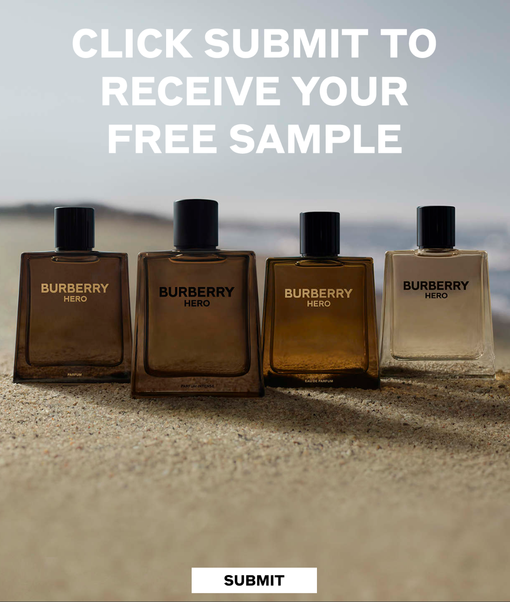

# freer-samples
Interface for repeated free sample requests

### Motivation
I was at the gym the other day, and saw a free samples dispenser for the Burberry Hero line of fragrances. I'd walked past it probably 50 times before realising it was more than an ad display. It provides you a QR code to scan, which then prompts you to hit the submit button for a free sample.

Hitting **Submit** brings you to a dead end page, while the screen on the dispenser prompts you to choose one of the four options via touch screen. So far I've only been able to get the *Parfum Intense* to dispense, although maybe I'm just not pressing hard enough.

Anyways, I though I'd make a tool to automate the submission process since 

- I feel awkward scanning a QR code
- You get locked out via a Cookie named `party-time`, and I don't appreciate being cut off!

Additionally I wanted to see how this gizmo works from a black-box perspective!